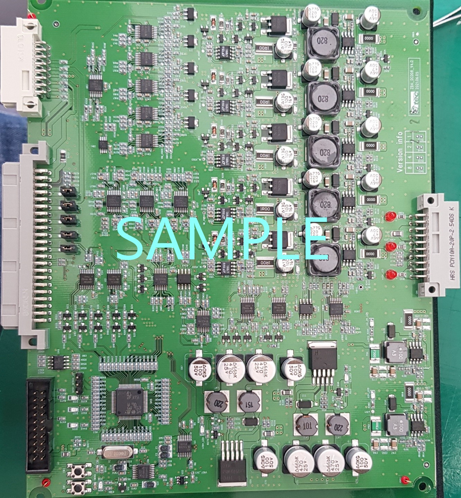

------

<!-- 보드명을 h1으로 입력해주세요 -->

# ZBA_DC008V4_2XXXXX

 

- [ ] 라이브러리 모듈화 완료 여부

## 보드소개

<!-- 보드에 대한 간단한 소개를 입력해주세요. 역할, 사용목적 등 -->

D20X의 완성 파워를 대체하는 보드입니다.

<!-- 보드의 실물사진을 업로드해주세요 readme_resource 폴더내 'Board'라는 이름으로 저장하시면 됩니다. Default:Board.jpg  -->

- ##### 실물 사진 

 

### 보드명 

<!-- Table의 빈칸을 채워주세요 -->

> | 보드 타입 | 보드명             | Version |
> | --------- | ------------------ | :------ |
> | 메인보드  | ZBA_DC008V4_2XXXXX | x.x.x   |

### 개발자

<!-- 펌웨어 개발한 사람이 누구인지를 적어주세요 -->

|   항복   | 개발자 | 비고 |
| :------: | :----: | :--: |
| FIRMWARE | 홍길동 | 퇴사 |
| HARDWARE | 고길동 |      |

------

### 기능

<!-- 보드 및 펌웨어 기능에 대해서 나열해 주세요 -->

* 5채널 구성(1A 출력)
* VI 모니터링
* ...

## 프로젝트 연결성

<!-- 해당 보드가 사용된 모든 프로젝트를 추가해주세요. 또는 다른 보드와 통신이 된다면 통신되는 보드들도 추가해 주세요 -->

> 해당 검사기와 연결성이 있는 PO 프로젝트 리스트를 나열 하십시오.

| 연결 명칭                                                    | 연결 내용                                         | 링크                                                         |
| ------------------------------------------------------------ | ------------------------------------------------- | ------------------------------------------------------------ |
| <!--본프로젝트명을 입력하세요-->D20X 광학검사기              | <!--연결내용을 입력하세요-->DCDC 완성 파워 대체   | <!-- 프로젝트 링크를 등록해주세요-->[프로젝트 이동](www.naver.com) |
| <!--다른 보드와 연결되는 보드가 있다면 추가해주세요-->LT 보드 | <!--연결내용을 입력하세요-->DCDC 보상을 위한 보드 | [프로젝트 이동](www.naver.com)                               |

------

## 프로젝트 이력

------

> 프로젝트 진행 후 발생되는 이력에 대해 업데이트 해주세요

| 날짜     | 이력 내용      | 링크 |
| -------- | -------------- | ---- |
| 21-00-00 | 이력 발생 내용 |      |
|          |                |      |
|          |                |      |
|          |                |      |

------

## 개발환경

<!-- 해당항목의 빈칸을 채워주세요. 해당사항이 없을 경우 ' - '나 'None'으로 표시바랍니다. -->

|    <h1> 항목</h1>    |          상세          |     비고      |
| :------------------: | :--------------------: | :-----------: |
|         MCU          |     AT32UC3C0512C      | [DataSheet]() |
| Porting OS(버전포함) |          None          |               |
|    보드명 및 버전    |    P201023, version    | [회로링크]()  |
|       사용 IDE       | Iar Embedded WorkBench |  AVR 6.80.8   |
|          IC          |    touch, ADC, ...     |   datasheet   |
|                      |                        |               |

----

### 라이브러리

> 사용 된 라이브러리의 이름과 버전 해당 저장소의 링크를 등록해 주세요.

| 라이브러리       | 적용 버전 | 링크     |
| ---------------- | --------- | -------- |
| GIOTHEC TOUCH IC | 2.4.5     | [link]() |
|                  |           |          |

[FW]: https://github.com/Lab1-FW/21P099LGD-GM-AUTO-LA107WF1-SLJ1-U21-FI-WING-BOARD
[touch]: 내PC\cloudium서버(U:)\연구1팀\연구팀공유폴더\6_PROJECT\Project_2021\9_LGDWing\FI검사기\P161_LGDGM_LA154WU1-SLJ1_FI_50EA\도면

[setimg]: res/System.jpg
